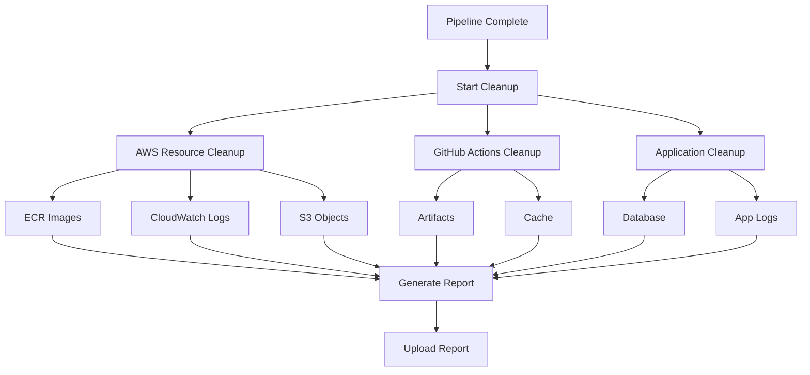

# CI/CD Pipeline Cleanup Guide

## Overview

This guide explains the comprehensive cleanup strategy implemented in the Spring Boot CI/CD pipeline to optimize costs and maintain resource hygiene.

**Cleanup Strategy:** Comprehensive  
**Execution:** Automated after each pipeline run  
**Retention Policy:** Environment-specific  

## 🧹 Cleanup Strategy Overview

### Cleanup Types

#### 1. Basic Cleanup
- Remove temporary build artifacts
- Clean Maven target directories
- Clear Docker build cache
- Remove unused GitHub Actions cache

#### 2. Comprehensive Cleanup (Current Implementation)
- All Basic cleanup features
- AWS resource cleanup (ECR, CloudWatch, etc.)
- Database cleanup (old snapshots, logs)
- Infrastructure resource optimization
- Cost optimization measures

#### 3. Aggressive Cleanup (Available)
- All Comprehensive features
- Force removal of stuck resources
- Temporary IAM role cleanup
- Emergency resource purging

## 🔧 Cleanup Components

### AWS Resources

#### Amazon ECR (Elastic Container Registry)
**What's Cleaned:**
- Old container images beyond retention limit
- Untagged images older than 1 day
- Images from failed builds

**Retention Policy:**
- Keep latest 10 images per repository
- Preserve tagged images (prod, staging, etc.)
- Remove untagged images after 24 hours

**Commands Used:**
```bash
# List old images
aws ecr describe-images --repository-name spring-boot-app \
  --query 'sort_by(imageDetails,& imageDigest)[:-10].[imageDigest]'

# Delete old images
aws ecr batch-delete-image --repository-name spring-boot-app \
  --image-ids imageDigest=$digest
```

#### Amazon ECS (Elastic Container Service)
**What's Cleaned:**
- Stopped tasks older than 24 hours
- Old task definitions (keep latest 10)
- Unused task definition revisions

**Retention Policy:**
- Keep latest 10 task definition revisions
- Remove stopped tasks after 24 hours
- Clean up service events older than 7 days

#### Amazon RDS (Relational Database Service)
**What's Cleaned:**
- Manual snapshots older than retention period
- Parameter groups not in use
- Option groups not attached to instances

**Retention Policy:**
- Dev environment: 7 days
- Staging environment: 14 days
- Production environment: 30 days (protected)

#### Amazon CloudWatch
**What's Cleaned:**
- Log streams older than retention period
- Empty log groups
- Unused metric filters
- Custom metrics older than 90 days

**Retention Policy:**
- Application logs: 14 days
- System logs: 7 days
- Security logs: 30 days
- Error logs: 30 days

#### Amazon S3
**What's Cleaned:**
- Build artifacts older than retention period
- Temporary files from deployments
- Incomplete multipart uploads
- Old backup files

**Lifecycle Policies:**
```yaml
artifacts-bucket:
  - name: "delete_old_artifacts"
    expiration_days: 30
  - name: "transition_to_ia"
    ia_transition_days: 7

build-cache-bucket:
  - name: "delete_cache"
    expiration_days: 7
```

### GitHub Actions Resources

#### Artifacts
**What's Cleaned:**
- Build artifacts older than 14 days
- Test reports and coverage data
- Security scan results
- Deployment packages

**Retention Policy:**
- Build artifacts: 14 days
- Test reports: 14 days
- Security reports: 30 days
- Pipeline reports: 30 days

#### Cache
**What's Cleaned:**
- Maven dependency cache
- Docker layer cache
- Node modules cache (if applicable)
- OS package cache

**Cache Management:**
- Maximum cache size: 2GB per repository
- Automatic cleanup of unused cache
- Cache key rotation every 7 days

### Application Resources

#### Database Cleanup
**What's Cleaned:**
- Audit log entries older than 90 days
- Temporary data tables
- Old migration backup data
- Session data older than 24 hours

**Cleanup Queries:**
```sql
-- Clean old audit logs
DELETE FROM audit_log WHERE changed_at < NOW() - INTERVAL 90 DAY;

-- Clean expired sessions
DELETE FROM sessions WHERE expires_at < NOW();

-- Clean temporary data
DELETE FROM temp_data WHERE created_at < NOW() - INTERVAL 1 DAY;
```

#### Application Logs
**What's Cleaned:**
- Application log files older than retention period
- Debug logs in production
- Performance monitoring data

## ⚙️ Cleanup Execution

### Automated Cleanup Triggers

1. **Post-Pipeline:** After every successful/failed pipeline run
2. **Scheduled:** Daily cleanup at 2 AM UTC
3. **Manual:** Via workflow dispatch
4. **Emergency:** Via emergency cleanup workflow

### Cleanup Process Flow



### Environment-Specific Policies

#### Development Environment
- **Aggressive cleanup:** Enabled
- **Retention:** 7 days
- **Resource protection:** Disabled
- **Cost optimization:** Maximum

#### Staging Environment
- **Standard cleanup:** Enabled
- **Retention:** 14 days
- **Resource protection:** Limited
- **Cost optimization:** Balanced

#### Production Environment
- **Conservative cleanup:** Enabled
- **Retention:** 30 days
- **Resource protection:** Maximum
- **Cost optimization:** Minimal impact

## 💰 Cost Impact

### Estimated Savings

#### Storage Costs
- **ECR Images:** ~$5-10/month saved
- **S3 Artifacts:** ~$2-5/month saved
- **CloudWatch Logs:** ~$3-8/month saved
- **EBS Snapshots:** ~$5-15/month saved

#### Compute Costs
- **Reduced resource contention:** ~5-10% improvement
- **Faster deployments:** ~2-5 minutes saved per deployment
- **Reduced data transfer:** ~$1-3/month saved

#### Total Monthly Savings
- **Development:** $15-25
- **Staging:** $20-35
- **Production:** $10-20 (conservative)
- **Total:** $45-80/month

### Cost Monitoring

```yaml
monitoring:
  cost_tracking:
    - metric: "storage_reduced"
      unit: "GB"
    - metric: "cost_savings"
      unit: "USD"
    - metric: "resources_cleaned"
      unit: "Count"
```

## 🔐 Safety Measures

### Resource Protection

#### Protected Resources
- Production database snapshots
- Tagged container images (prod, staging)
- Configuration backups
- Security audit logs

#### Protection Mechanisms
```yaml
protected_resources:
  - pattern: "prod-*"
    reason: "Production resources"
  - pattern: "*-backup"
    reason: "Backup data"
  - pattern: "security-*"
    reason: "Security logs"
```

#### Confirmation Requirements
- Manual confirmation for production resources
- Approval gates for large cleanup operations
- Backup verification before deletion

### Rollback Procedures

#### If Cleanup Goes Wrong
1. **Stop cleanup process**
   ```bash
   aws ecs stop-task --cluster cleanup-cluster --task $TASK_ARN
   ```

2. **Restore from backups**
   ```bash
   aws rds restore-db-instance-from-db-snapshot \
     --db-instance-identifier restored-db \
     --db-snapshot-identifier backup-snapshot
   ```

3. **Recreate resources**
   ```bash
   terraform apply -target=aws_ecr_repository.app
   ```

## 📊 Monitoring and Reporting

### Cleanup Metrics

#### Key Performance Indicators
- **Resources cleaned per run**
- **Storage space freed**
- **Cost savings achieved**
- **Cleanup execution time**
- **Error rate**

#### Reporting Dashboard
```yaml
metrics:
  - name: "cleanup_execution_time"
    type: "gauge"
    description: "Time taken for cleanup execution"
    
  - name: "resources_cleaned_total"
    type: "counter"
    description: "Total number of resources cleaned"
    
  - name: "storage_freed_bytes"
    type: "gauge"
    description: "Storage space freed in bytes"
    
  - name: "cost_savings_usd"
    type: "gauge"
    description: "Estimated cost savings in USD"
```

### Cleanup Reports

#### Daily Cleanup Report
```json
{
  "date": "2025-09-23",
  "environment": "all",
  "summary": {
    "ecr_images_removed": 15,
    "s3_objects_deleted": 234,
    "log_groups_cleaned": 8,
    "storage_freed_gb": 12.5,
    "estimated_savings_usd": 5.75
  },
  "errors": [],
  "execution_time_seconds": 187
}
```

#### Weekly Cleanup Summary
- Total resources cleaned
- Cumulative cost savings
- Trend analysis
- Recommendations for optimization

### Notifications

#### Success Notifications
- Cleanup completion summary
- Cost savings achieved
- Next scheduled cleanup

#### Error Notifications
- Failed cleanup operations
- Resources that couldn't be cleaned
- Manual intervention required

#### Warning Notifications
- Approaching storage limits
- High cleanup frequency
- Resource protection conflicts

## 🛠️ Manual Cleanup Operations

### Emergency Cleanup

For urgent space or cost issues:

```bash
# Trigger emergency cleanup
gh workflow run emergency-cleanup.yml \
  --ref main \
  --field environment=dev \
  --field aggressive=true
```

### Selective Cleanup

For specific resource types:

```bash
# Cleanup specific resource type
gh workflow run selective-cleanup.yml \
  --ref main \
  --field resource_type=ecr \
  --field older_than_days=7
```

### Cleanup Validation

Verify cleanup results:

```bash
# Check cleanup status
aws ecr describe-repositories --query 'repositories[].repositoryName'
aws s3 ls s3://artifacts-bucket --recursive
aws logs describe-log-groups --query 'logGroups[].logGroupName'
```

## 📋 Best Practices

### Resource Management
1. **Tag resources consistently** for easier identification
2. **Use lifecycle policies** where available
3. **Monitor cleanup effectiveness** regularly
4. **Adjust retention policies** based on needs

### Cost Optimization
1. **Run cleanup after each deployment**
2. **Schedule regular cleanup jobs**
3. **Monitor cost impact** of cleanup operations
4. **Optimize cleanup frequency** based on usage

### Safety
1. **Always backup critical data** before cleanup
2. **Test cleanup in development** first
3. **Use gradual rollout** for new cleanup policies
4. **Have rollback procedures** ready

### Monitoring
1. **Set up alerts** for cleanup failures
2. **Track cost savings** metrics
3. **Review cleanup logs** regularly
4. **Adjust policies** based on results

---

**Last Updated:** 2025-09-23  
**Cleanup Strategy Version:** v1  
**Next Review:** 2025-10-23